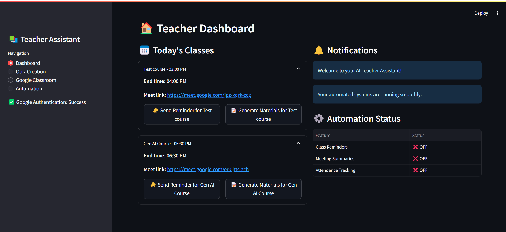
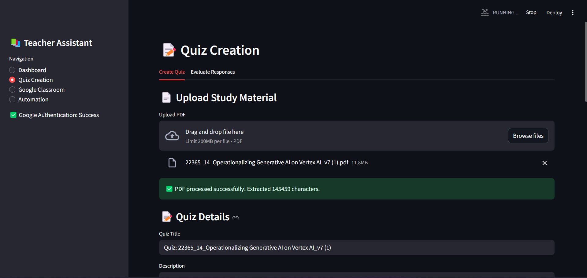
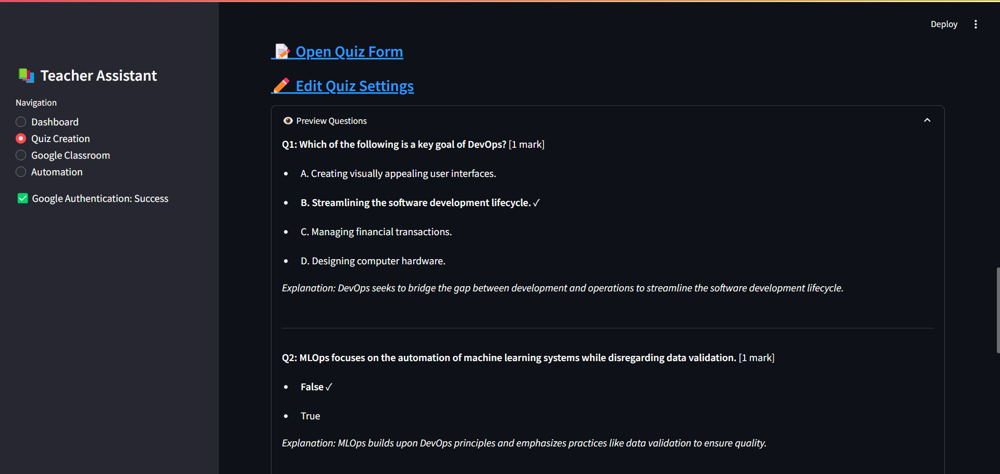
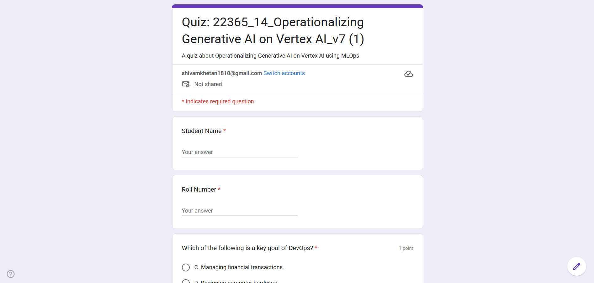
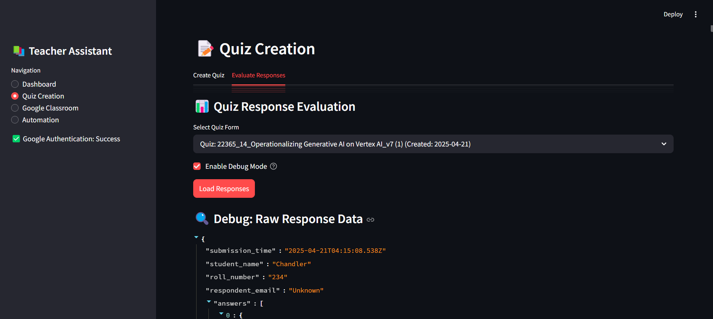
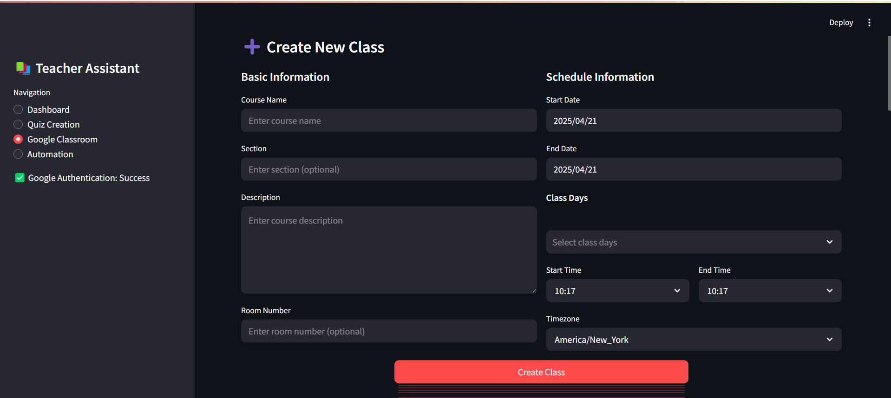
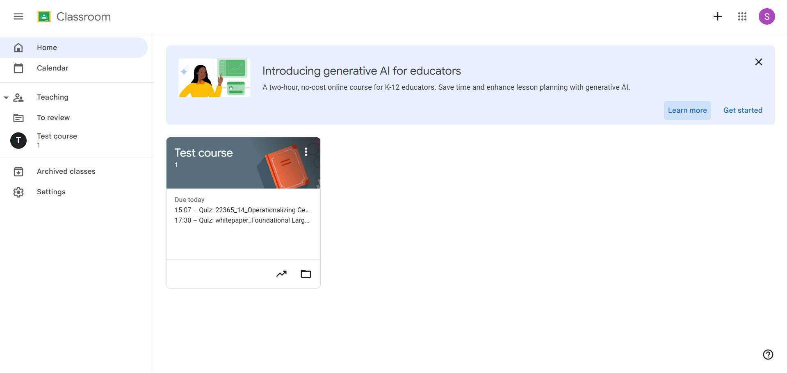
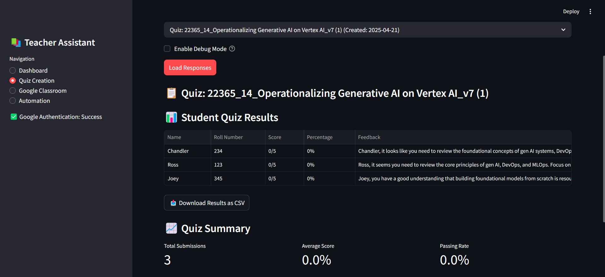
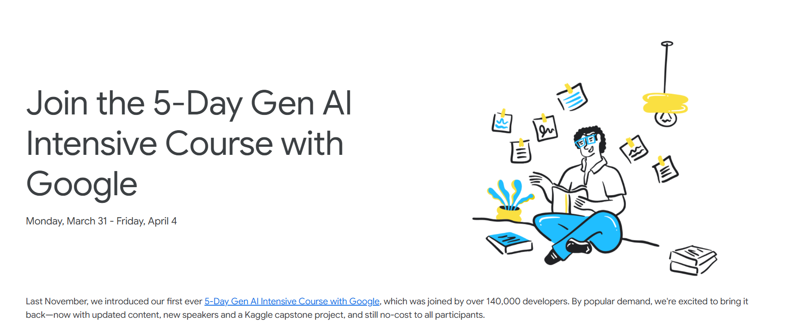

# 🧑‍🏫 Teacher Assistant App

An AI-powered web application designed to automate and simplify routine teaching tasks—built in just **one hour** during the **5-Day Generative AI Intensive** by **Google & Kaggle**. This project leverages **Gemini AI** and **Google Cloud services** to empower educators with intelligent tools for classroom management, quiz creation, grading, and more.

---

## 🚀 Project Highlights



- ⏱️ **Built in ~1 hour** thanks to the seamless integration of Google Workspace APIs
- 💡 Powered by **Gemini AI (Vertex AI)** for intelligent content generation
- 📚 Integrates directly with **Google Classroom, Forms, Calendar, Meet**, and **Drive**
- 🎓 Designed to save teachers hours every week by automating repetitive workflows

---

## 📦 Features

### 📊 Dashboard


- Overview of today's classes
- Quick access to Google Meet links
- One-click reminders
- Status panel for automations (reminders, summaries, attendance)

### 📝 Pdf understanding and Quiz config



- Upload PDFs (textbooks, lecture notes)
- Configure question types, difficulty, and parameters

### 📝 Quiz Creator



- AI generates Google Form quizzes with answer keys

### 📝 Quiz Uploaded on Google forms



- Automatically posts quiz to Google Classroom

### 🧮 Evaluate Responses



- Connects to Forms and fetches student submissions
- Generates scores and class performance summaries
- Uses Gemini AI to create **personalized feedback**
- Exports results to CSV

### 🏫 Classroom Manager



- Create and manage Google Classroom courses
- Schedule recurring classes
- Post announcements and assignments from within the app

### 🤖 Automations



- Auto reminders before classes
- Auto summaries after sessions
- Attendance tracking using Google Meet & Calendar data

---

## 🧠 Built With

- **Gemini Pro API (Vertex AI)** – Prompt-based content generation
- **Google Workspace APIs:**
  - Google Classroom API
  - Google Forms API
  - Google Calendar API
  - Google Drive API
  - Google Meet API
- **Google Cloud Platform (GCP):**
  - Google Cloud Storage – File uploads and resource management
  - OAuth 2.0 & Service Accounts – Secure authentication
- **Python / JavaScript** – App logic & UI
- **Flask / Streamlit** – Backend web framework

---

## 🔧 Setup Instructions

### 1. Clone the Repository

```bash
git clone https://github.com/yourusername/teacher-assistant-app.git
cd teacher-assistant-app
```

### 2. Set Up Google Cloud Credentials

#### a. Enable APIs in Google Cloud Console

- Go to [Google Cloud Console](https://console.cloud.google.com/)
- Enable the following APIs:
  - Vertex AI API
  - Google Classroom API
  - Google Forms API
  - Google Calendar API
  - Google Drive API

#### b. Create OAuth 2.0 Credentials

- Go to **APIs & Services > Credentials**
- Click **"Create Credentials" > OAuth client ID**
- Choose **"Web application"** and add authorized redirect URIs if needed
- Download the `credentials.json` file and place it in your project directory

#### c. Get API Key from Google Studio

- Visit [Google API Console](https://console.cloud.google.com/apis/credentials)
- Click **"Create credentials" > API key**
- Use this API key in your `.env` or config file as needed

### 3. Install Dependencies

Make sure you have Python installed, then run:

```bash
pip install -r requirements.txt
```

### 4. Run the app

Start the app using Streamlit:

```bash
streamlit run main.py
```

---

## 📸 Screenshots

### Quiz Generation Interface


### Student Analytics Dashboard



### Automation Configuration Panel


---

## 🔮 Roadmap

- [ ] Add support for automatic lesson plan generation
- [ ] Implement AI-powered student engagement analytics
- [ ] Create a mobile companion app for on-the-go management
- [ ] Develop a chatbot for immediate student queries

---

## 🤝 Contributing

Contributions are welcome! Please feel free to submit a Pull Request.

## 📄 License

This project is licensed under the MIT License - see the LICENSE file for details.

---



<p align="center">
  <strong>Made with ❤️ during Google & Kaggle's 5-Day Generative AI Intensive</strong>
</p>
